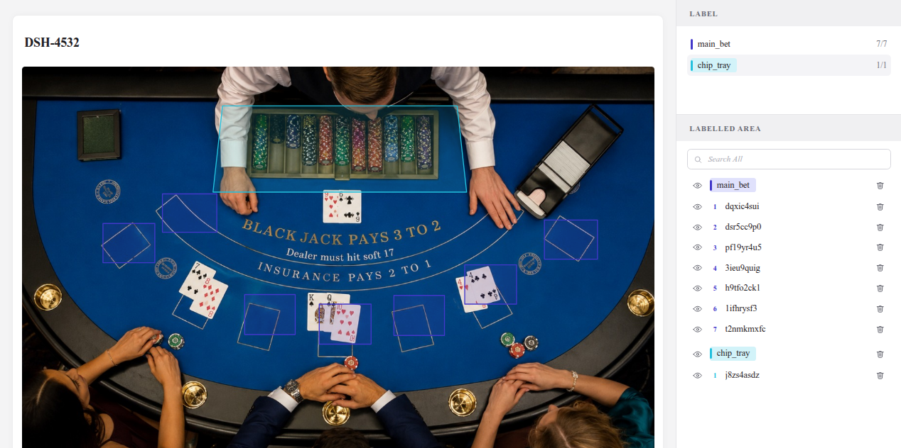

# Camera Calibration Tool

A frontend prototype of Aeyesky's camera calibration screen: an operator draws
and labels polygonal regions over a still frame from a table camera, then saves
the result as a calibration file.

Built from the provided Figma design (`Aeyesky-Coding Assignment`).



## Setup

Requires Node 18+.

```bash
npm install
npm run dev      # http://localhost:5173
```

Other scripts:

```bash
npm run build      # production build to dist/
npm run preview    # serve the production build
npm run typecheck  # tsc --noEmit
```

## How to use it

| Action | How |
| --- | --- |
| Pick a category | Click a label in the **LABEL** panel — this also arms the polygon tool |
| Draw a region | Polygon tool (`P`), click to place anchors, click the first anchor (or double-click) to close |
| Undo an anchor | `Backspace` while drawing |
| Cancel a drawing | `Esc` |
| Select a region | Select tool (`V`), click the region — or click its row in **LABELLED AREA** |
| Select several | `Shift`/`Cmd`+click to add, drag a box on empty canvas to marquee-select, `Cmd`/`Ctrl`+`A` for all |
| Select a whole label | Click the label chip in a **LABELLED AREA** group header |
| Move a region | Drag it with the select tool — a multi-selection moves together |
| Copy / paste | `Cmd`/`Ctrl`+`C`, then `Cmd`/`Ctrl`+`V` (each paste is offset so copies don't hide) |
| Duplicate in place | `Cmd`/`Ctrl`+`D` |
| Reshape a region | Double-click it to enter anchor-edit mode, then drag anchors |
| Add an anchor | Click a dashed edge midpoint in anchor-edit mode |
| Remove an anchor | `Alt`+click an anchor (minimum 3) |
| Change a region's label | Click the id badge above a selected region |
| Hide / show | Eye icon on a row, or on a group header for all of that label |
| Delete | Trash icon (confirmation dialog), or `Delete` with regions selected — a multi-selection is removed in one confirmation, and a bar above the list shows the count with **Clear** / **Delete** |
| Save | **Save Calibration** — downloads the JSON and writes to `localStorage` |

## Coordinate format

**Polygon vertices are normalised to the source image: `x, y ∈ [0, 1]`, origin
top-left, x increasing rightwards and y increasing downwards.**

To convert to pixels for a frame of any resolution:

```
px = x * image.width
py = y * image.height
```

Vertices are stored in draw order and the ring is **implicitly closed** — the
last vertex connects back to the first, and the first vertex is not repeated.
Winding direction is not normalised (it follows the operator's draw order), so
consumers that care about orientation should compute the signed area.

Normalised rather than pixel coordinates because the calibration describes a
*camera view*, not a *particular JPEG*: the same regions stay valid if the feed
is later delivered at 4K instead of 1080p, and the editor can be resized or the
image scaled without rewriting stored data.

### Saved file

`Save Calibration` downloads `calibration-DSH-4532.json`. A real export produced
by the app is checked in at [`docs/example-calibration.json`](docs/example-calibration.json).

```jsonc
{
  "version": 1,
  "cameraId": "DSH-4532",
  "savedAt": "2026-07-27T20:30:24.632Z",
  "image": { "source": "/table.jpg", "width": 1293, "height": 893 },
  "coordinateSystem": {
    "space": "normalized",
    "origin": "top-left",
    "xAxis": "left-to-right",
    "yAxis": "top-to-bottom",
    "range": [0, 1],
    "note": "…"
  },
  "areas": [
    {
      "id": "gbj560ono",              // unique identifier
      "label": "main_bet",            // area label
      "polygon": [                    // polygon coordinates, normalised
        [0.128, 0.36],
        [0.21,  0.36],
        [0.21,  0.45],
        [0.128, 0.45]
      ],
      "visible": true,
      "createdAt": "2026-07-27T20:29:28.769Z"
    }
  ]
}
```

`image` is embedded so a consumer can reconstruct pixel coordinates without
having to know which frame was calibrated. `coordinateSystem` is written into
every file so the format is self-describing rather than relying on this README.

## Technical approach

**Stack:** React 18 + TypeScript + Vite, Zustand for state. No canvas, geometry
or UI libraries.

**SVG instead of `<canvas>`.** The regions are a handful of polygons with
handles, not a high-frequency render loop. SVG gives hit-testing, hover states,
cursors and crisp strokes at any zoom essentially for free, keeps everything
inspectable in devtools, and stays accessible to the DOM. A canvas would have
meant hand-rolling picking and redraw for no benefit at this scale.

**Coordinates converted in JS, not by `viewBox`.** The image is laid out with
`max-width/height: 100%`, so its rendered size is only known after layout. A
`ResizeObserver` on the image frame feeds the displayed size into the component,
and normalised points are multiplied into screen pixels at render time. Using a
normalised `viewBox` would have been less code but would scale stroke widths and
handle radii with the image, so anchors would be unusably small on a large
display and fat on a small one.

**A single flat store.** All editor state — areas, tool, draft polygon,
selection, edit mode, pending deletion — lives in one Zustand store, so the
canvas and the layer panel are two views of the same state and selection sync
between them is automatic rather than plumbed through props.

**Interaction state is explicit.** `draft` (mid-drawing), `selectedIds`
(bounding box + badge) and `editingId` (draggable anchors) are separate fields
rather than one overloaded mode enum, which is what makes the design's three
distinct polygon appearances fall out directly. Selection is a list rather than
a single id so regions can be copied, moved and deleted in bulk; anchor editing
stays deliberately single-region, and entering it narrows the selection.

**Clipboard is in-app first.** Copy mirrors regions to the OS clipboard as JSON
so they survive across tabs and sessions, but paste reads the in-app clipboard
whenever it has contents. Reading the system clipboard can block on a permission
prompt or never settle when the page isn't focused, which would make paste feel
broken — the OS clipboard is only consulted when nothing was copied in this tab.

**Labels are configuration.** `src/config.ts` holds the label catalogue with its
colours and required counts; adding a category is a one-line change with no
component edits. In production this would be fetched per table type.

### Key tradeoffs

- **Zustand over Redux/Context.** The app is one screen with frequent
  pointer-driven updates. Zustand gives selector-level subscriptions without a
  reducer/action layer that would not earn its keep here.
- **No undo/redo stack.** The store is written for direct mutation of areas.
  A command history is the single largest thing I would add next, and the
  action-shaped store methods are the seam it would slot into.
- **Geometry written by hand.** Point-in-polygon, bounding box and edge
  midpoints are ~40 lines in `src/lib/geometry.ts`. Pulling in a geometry
  library for that would have added a dependency for less code than it saved.
- **`localStorage` as the fake backend.** Work survives a reload, which makes
  the prototype usable, without pretending to be a real persistence layer.

### Project layout

```
src/
  components/
    CanvasStage.tsx   drawing, selection, anchor editing, rendering
    LabelPanel.tsx    LABEL section — category picker + completion counts
    LayerPanel.tsx    LABELLED AREA section — grouped list, search, multi-select, visibility
    ConfirmDialog.tsx delete confirmation
    Toolbar.tsx       select / polygon tools
    icons.tsx
  lib/
    geometry.ts       point-in-polygon, bbox, midpoints, group clamping, id generation
    clipboard.ts      region copy/paste envelope + OS clipboard interop
    persistence.ts    calibration file build / download / localStorage
  store.ts            single Zustand store
  config.ts           label catalogue, camera id, image metadata
  types.ts            domain types + coordinate format documentation
```

## Assumptions

Things the design left open, and the calls I made:

1. **`main_bet 3/7` means "3 drawn of 7 required".** The red warning icon on an
   incomplete count supports this, so required counts became part of the label
   config (7 betting spots, 1 chip tray) and drive the warning state.
2. **The two toolbar icons are select and polygon.** The design shows exactly
   two tools and the notes only describe polygon drawing.
3. **"Click the label to switch category" (note 6) refers to the id badge** on a
   selected polygon, since that is the only label attached to a region on the
   canvas. It opens a small category popover.
4. **The tool stays armed after closing a polygon.** An operator drawing seven
   betting spots in a row should not have to re-arm the tool seven times.
5. **Minimum three vertices** for a valid region.
6. **Hidden regions cannot be deleted** — the design greys out the trash icon on
   the hidden row, so it is disabled rather than merely styled.
7. **Group headers act on the whole label group** (hide all / delete all). The
   design shows an eye and a trash on the group row but does not specify them.
8. **The background image is a still frame** cropped from the Figma mock, served
   as a static asset. A real tool would pull a frame from the camera.
9. **`DSH-4532` is a camera/table identifier**, displayed read-only.
10. **Ids are random 9-character strings**, matching the style shown in the
    design (`23wpfu238`, `a1b2c3d4`). A real system would use server-issued ids.

### Product questions I would ask

- Are region labels one-to-many per category, or is each of the seven betting
  spots a distinct labelled position (`main_bet_1` … `main_bet_7`)? The design's
  numbered index badges hint at the latter, which would change the data model.
- Should regions be constrained to be convex, or non-self-intersecting? Nothing
  currently prevents an operator drawing a bowtie.
- Can regions overlap? Chip trays and bet spots plausibly should not.
- Is a calibration saveable while incomplete? Currently yes, with a warning —
  blocking the save would be easy but seems wrong for a long, interruptible task.
- What happens to an existing calibration when the camera moves? Is there a
  re-calibration flow that preserves labels and only adjusts geometry?

## Known limitations

- **No undo/redo.**
- **No zoom or pan.** Fine-grained work on small regions at 1080p is harder than
  it should be; a zoomable viewport is the next thing an operator would ask for.
- **No self-intersection or overlap validation.**
- **Bounding-box handles are decorative** — they render the selected state from
  the design but do not scale the polygon. Reshaping is done via anchor editing.
- **Marquee selection uses bounding-box intersection**, so it catches any region
  the box touches rather than only fully-enclosed ones. That matches the
  expectation set by most design tools, but it does mean a large concave region
  can be caught by a box that never visually overlaps its filled area.
- **Relabelling works one region at a time.** The id badge is the entry point for
  switching category, and it is only shown on a single selection because badges
  would stack illegibly otherwise.
- **Copy/paste and multi-select are keyboard-driven.** There is no context menu;
  discoverability rests on the hint bar under the canvas and the selection bar
  in the layer panel.
- **Search matches ids and label names only**, not any free-text field, since
  regions have no name field in the design.
- **Touch is untested.** Pointer events are used throughout so it should
  largely work, but no touch-specific affordances (larger hit targets,
  long-press) were added.
- **No automated tests.** Given the time budget I verified behaviour by driving
  the running app in a real browser (drawing, closing, selecting, dragging
  anchors, inserting vertices, hiding, deleting, saving) and asserting on the
  resulting DOM and exported JSON, including checking that saved coordinates
  match on-screen geometry exactly. The geometry helpers in `lib/geometry.ts`
  are pure functions and are where I would start with unit tests.
- **Accessibility is partial.** Buttons are labelled and the dialog is a proper
  `alertdialog`, but the canvas itself is pointer-only — there is no keyboard
  path to draw or select a region.

## Approximate time spent

~3 hours: ~30 min reading the design and notes, ~1h45m building, ~45 min
verifying in-browser and writing this README.

## AI tools used

Built with **Claude Code** (Claude Opus 5), used as a pair-programmer for the
whole exercise rather than for isolated snippets.

**How it was used:**

- **Design extraction.** I pointed it at the Figma link and the exported PNGs.
  The Figma MCP server needed an OAuth round-trip, so it read the four exported
  frames directly instead and derived the component inventory, the two
  annotation sheets (anchor-point states, line colours, selection vs. edit mode,
  layer-panel hover/delete/visibility behaviour) and the colour palette from the
  images.
- **Scaffolding and implementation.** Vite/TS config, the Zustand store shape,
  the SVG canvas component, panels and the CSS design system.
- **Verification.** It drove the running app through Chrome DevTools —
  dispatching pointer sequences to draw polygons, enter anchor-edit mode, drag
  and insert vertices, toggle visibility and delete — then asserted on the DOM
  and on the exported JSON.

**Representative prompts:**

- "Read these four exported Figma frames and tell me every interaction state the
  notes specify."
- "Build the calibration screen: React + TS + Vite, SVG overlay on the table
  image, Zustand store, polygon and select tools."
- "Implement the draft-polygon states from the notes: hollow anchors, filled
  last anchor, light-blue rubber-band line, blue committed segments, close by
  clicking the first point."
- "Drive the app in Chrome and verify drawing, edit mode, vertex insertion,
  delete confirmation and the saved JSON."

**Where I changed, corrected or rejected a suggestion:**

The clearest case was a refactor going wrong. Pointer capture was being set up
inline in three places, so it was extracted into a `capturePointer(e)` helper —
and the extraction was applied with a `sed` replacement of
`e.currentTarget.setPointerCapture(e.pointerId)`. That pattern also matched the
line *inside the new helper's own body*, rewriting it to call itself:

```ts
const capturePointer = (e) => {
  try {
    capturePointer(e);   // infinite recursion — every drag would blow the stack
  } catch {}
};
```

`tsc --noEmit` passed, because infinite recursion is perfectly well-typed. It
was caught by reading the resulting diff rather than trusting the green
typecheck, and reverted to the intended body. The lesson I applied for the rest
of the session: a passing typecheck says nothing about whether a mechanical
refactor did what you meant, and blind pattern-replacement across a file is
exactly where that gap bites.

Two design suggestions I pushed back on:

- Rendering the SVG with a normalised `viewBox="0 0 1 1"` was proposed first —
  it makes the coordinate conversion disappear entirely. I rejected it because a
  normalised viewBox scales stroke widths and handle radii with the image, so
  anchors would render as sub-pixel dots on a large display and as blobs on a
  small one, and the 9-pixel grab threshold would mean a different physical
  distance at every window size. The `ResizeObserver` approach was used instead.
- Returning to the select tool after each closed polygon is the conventional
  default; I changed it after thinking about the actual job, which is drawing
  seven betting spots in a row.

One debugging note worth recording, since it looked like an application bug and
was not: the first attempts to drive the canvas with synthetic `PointerEvent`s
did nothing at all. React 18 ignores pointer events whose `isPrimary` is false,
and that property defaults to `false` on hand-constructed events. The app was
correct; the test harness was wrong. Worth knowing before concluding that
pointer handling is broken.
